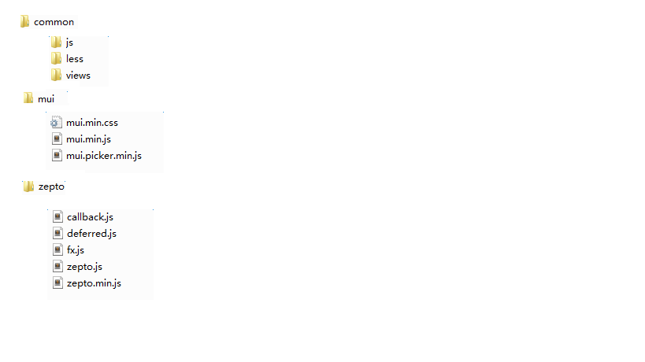

# 框架目录结构说明

本框架基于`mui`，在`mui`基础上做了扩展和样式重置，以适应移动端项目的需要，具体目录结构如下：

 

### 目录说明

1. `common`文件夹：里面每个组件都有独立的文件夹，放置每个组件需要的文件，及对`mui`的样式进行重置的`resetMui.less`文件

2. `mui`文件夹：放置`mui`相关文件

3. `zepto`：放置`zepto`相关文件

### 框架的使用

1. 由于框架基于`mui`，需要先引入`mui`的样式文件`mui.min.css`和`js`文件`mui.min.js`

2. 在页面逻辑代码中，需要首先进行`mui`的初始化：`mui.init();`

3. 本框架还提供了另外四个基本样式文件： `color.less、reset.less、baseClass.less、resetMui.less`，介绍及使用场景见下一篇文章**不同类型html页面及对应的基本样式文件说明**
