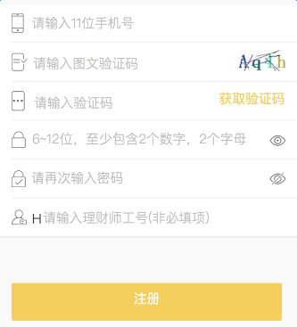
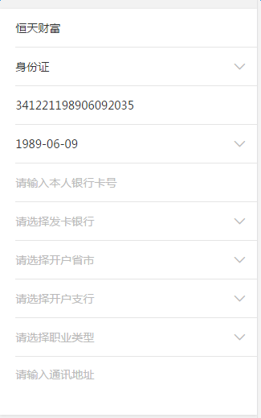

# 表单

表单组件建立在列表组件和选择器picer的基础上，因此在阅读本文时，请先阅读列表组件和选择器picer的内容~

### 相关说明

       

上面这两个图，都是表单：

图一：手机号、图文验证码、短信验证码、密码、确认密码、理财师工号

图二：姓名、证件类型、证件号码、生日、银行卡号……

可以看出，在表单中，每一行都是不同的，也许是`input`输入框，也许是选择器，不论是什么，内容都是不一样的，也就是说，提交给服务器都是不同字段的数据。

因此，这里将**每一行叫做一个表单元素**，不同的元素**根据内容（数据）做区分**。

##### 注意：

1. 表单元素可分为两种：

	1）输入类（`text、password、textarea`等）

	2）选择类（证件类型、发卡银行、生日等），点击出现选择器，用户可选择而不可输入

2. 输入类的表单元素，结构都可以分为三个区域，从左到右分别为：

	1）左边`icon`

	2）输入区

	3）右边`icon`（眼睛、帮助？的图标等）/图文验证码的图片/短信验证码的按钮

	其中，第2个区域是肯定存在的，而第1和第3个区域是有的表单需要，有的表单不需要的，因此需要分别处理。


### 表单的`DOM`结构及`css`样式

首先，引入表单组件的样式文件`newFormMui.less`

然后，在html中添加DOM结构，详细说明如下：

##### 表单容器：

```
	<div class="form-wrap">
		<!-- 放置任意表单元素 -->
	</div>
```

一个完整的表单，需要将所有表单元素都放入一个表单容器中，这样才能使用`newFormMui.less`中的表单样式。

表单容器的`class`：`form-wrap`


##### 输入类表单元素：

最基本的结构，是一行内只有一个输入区的：

```
	<div class="form-wrap">
		<!-- 姓名 -->
		<div class="formList">
			<div class="mui-input-row">
				<input type="text" class="mui-input-clear" placeholder="请输入姓名">
			</div>
		</div>
	</div>
```

说明：

1）每一个输入类的表单元素，`class`都必须含有`formList`

2）在`formList`里面，嵌套一个`class`为`mui-input-row`的节点

3）`mui-input-row`里就是`input`输入框了，如果该输入框内需要有`x`这个清除内容按钮，需要给`input`的`class`属性添加`mui-input-clear`，`mui`会自动为这个按钮添加点击清除内容的事件


现在，在这个最基本的结构上，添加点不一样的东西~

1. 添加左边的`icon`

```
	<div class="form-wrap">
		<!-- 手机号码 -->
		<div class="formList formIconLeft">
			<span class="iconfont">&#xe665;</span>
			<div class="mui-input-row">
				<input type="tel" class="mui-input-clear" placeholder="请输入11位手机号码" maxlength="11">
			</div>
		</div>
	</div>
```

说明：

在这个手机号码的表单元素中，出现了左边的`icon`图标。这时：

1）在`formList`节点上，添加了`class`属性`formIconLeft`，表示该元素内有左边的`icon`图标

2）此`icon`图标的宽度是固定的，需要有`class`属性为`iconfont`


2. 有右边的icon

```
	<div class="form-wrap">
		<!-- 手机号码 -->
		<div class="formList formIconRight">
			<div class="mui-input-row ">
				<input type="password" class="mui-input-clear" placeholder="6-12位，至少包含2个数字，2个字母">
			</div>
			<span class="iconfont noEye"></span>
		</div>
	</div>

```

说明：

在这个手机号码的表单元素中，出现了右边的眼睛`icon`。这时：

1）在`formList`节点上，添加了`class`属性`formIconRight`，表示该元素内有右边的icon图标

2）此icon图标的宽度是固定的，需要有`class`属性为`iconfont`

右边的`icon`有两种情况：

1）眼睛：需要在`span`标签上添加`class`为`noEye`

2）表示帮助的？图标：需要在`span`标签上添加`class`为`help`


3. 右边不是`icon`，而是图文验证码的图片

```
	<div class="form-wrap">
		<!-- 图文验证码 -->
		<div class="formList verifyCode">
			<div class="mui-input-row">
				<input class="mui-input-clear" type="text" placeholder="请输入图文验证码"/>
			</div>
			
		</div>
	</div>

```

说明： 

1） 在`formList`节点上，添加了`class`属性`verifyCode`，表示该元素为图文验证码

2） 在`mui-input-row`节点的后面，添加了`img`标签，`class`为`twyzm_img`，为图文验证码的图片


4. 右边不是`icon`，而是短信验证码的按钮

```
	<div class="form-wrap">
		<!-- 图文验证码 -->
		<div class="formList numberCode">
			<div class="mui-input-row">
				<input class="mui-input-clear" type="text" placeholder="请输入图文验证码"/>
			</div>
			<span class="dxyzmBtn" checkTop="true">获取验证码</span>
		</div>
	</div>

```

说明： 

1） 在`formList`节点上，添加了`class`属性`numberCode`，表示该元素为短信验证码

2） 在`mui-input-row`节点的后面，添加了`span`标签，`class`为`dxyzmBtn`，为短信验证码的按钮


##### 选择类表单元素

选择类的表单元素（证件类型、生日、发卡银行、省市等）是点击出现选择器，用户选择后，将结果显示到页面上的，
用户不能手动输入。

这类元素，右侧有箭头，看起来跟**列表组件**的结构一样，因此是用**列表组件**的结构实现的。

```
	<div class="form-wrap">
		<!-- 证件类型 -->
		<ul class="mui-table-view"> 
		    <li class="mui-table-view-cell mui-collapse">
		        <a class="mui-navigate-right" href="javascript:;" num="" errortip="请选择证件类型">请选择证件类型</a>
		    </li>
		</ul>
	</div>
```

可以看出，这完全就是一个列表的结构，因此可以使用列表组件的class属性根据不同的情况有不同的表现。


